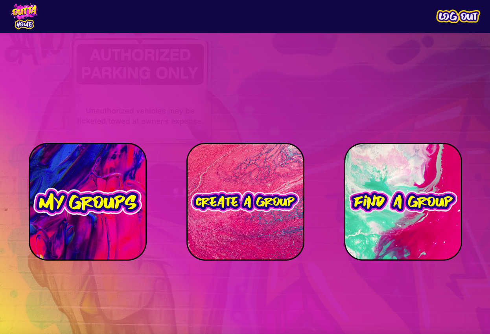
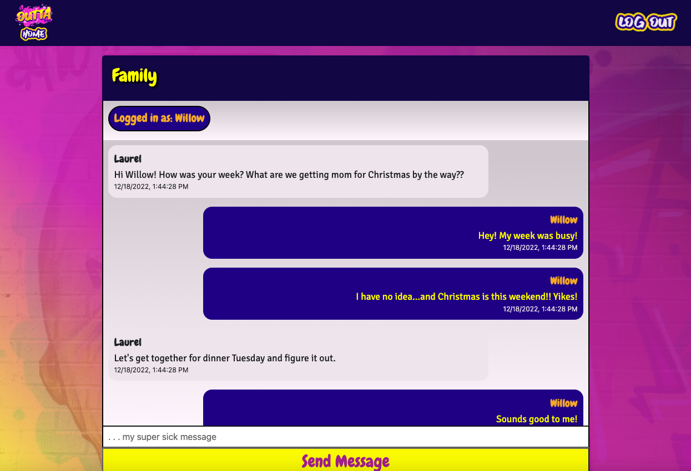
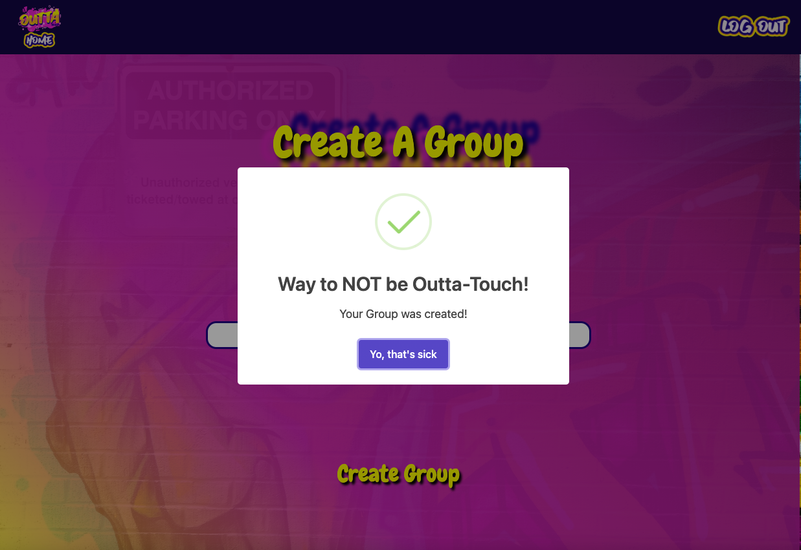

# OUTTA TOUCH

## Description

A real time social application seeking to connect friends and family through messages, photos and other content.

- The primary motivation behind the project was to create a true MERN full stack application taking advantage of the latest technologies and trends.
- This app keeps family and friends in touch without the public exposure of similar web applications.
- This project rendered a deeper understanding of queries and mutations, Apollo server and how to develop a subscription or listener between the client and server for real time updates.

## Table of Contents

- [Installation](#installation)
- [Usage](#usage)
- [Credits](#credits)
- [License](#license)

## Installation

Installation is as easy as navigating to the appropriate URL in your favorite browser.  Click Install and download the app to your machine.  Create an account, sign in and start chatting!

## Usage

1. From the landing page, click Sign Up to create an account.
2. Once in your dashboard, choose Create a Group. In the chat room window, click the mail icon in the upper right corner to invite fellow users to your chat.
3. Upon returning to your dashboard, options to create additional groups, find groups by searching their name or viewing the groups you are a part of will appear.

## Credits

- **Kaileb Hammontree**
  - Email: hammontreewebdev@gmail.com
  - GitHub Profile: https://github.com/HammontreeWebDev
- **Brandon Hill**
  - Email: hillbp2014@gmail.com
  - GitHub Profile: https://github.com/LuckySal
- **Craig Putzstuck**
  - Email: putzstuck@gmail.com
  - GitHub Profile: https://github.com/argounova

## License

MIT License